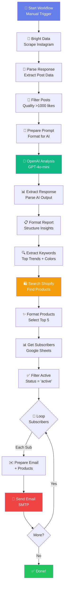

# Fashion Newsletter Workflow - Visual Guide

> A visual representation of how the complete workflow operates

---

## 🎯 Complete Workflow Diagram



---

## 📦 Data Flow Visualization

```
INPUT                  PROCESSING              OUTPUT
─────                  ──────────              ──────

Instagram Posts  →     AI Analysis      →     Trend Insights
    |                       |                       |
    |                       ↓                       |
    |                  [GPT-4o-mini]                |
    |                       |                       |
    ↓                       ↓                       ↓

 Post Data          Trend Keywords         Product Search
    |                       |                       |
    ↓                       ↓                       ↓
[Bright Data]         [Extraction]           [Shopify API]
    |                       |                       |
    ↓                       ↓                       ↓

Filtered Posts     Search Queries         Matched Products
    |                       |                       |
    └───────────────────────┴───────────────────────┘
                            |
                            ↓

                    Subscriber List
                            |
                            ↓
                     [Google Sheets]
                            |
                            ↓

                   Email for Each
                            |
                            ↓
                    [SMTP Provider]
                            |
                            ↓

                    📧 Delivered!
```

---

## 🔄 Node-by-Node Breakdown

### Phase 1: Data Collection
```
┌────────────────────────────────────────────┐
│ 1. Start Scraper (Manual Trigger)         │
│    • Workflow begins manually              │
│    • Can be scheduled for automation       │
└────────────────┬───────────────────────────┘
                 │
                 ▼
┌────────────────────────────────────────────┐
│ 2. Bright Data - Get Instagram Posts      │
│    • Calls Bright Data API                 │
│    • Fetches fashion-related posts         │
│    • Returns 50-100 posts                  │
└────────────────┬───────────────────────────┘
                 │
                 ▼
┌────────────────────────────────────────────┐
│ 3. Parse Bright Data Response             │
│    • Extracts post details                 │
│    • Normalizes data structure             │
│    • Calculates engagement rates           │
└────────────────┬───────────────────────────┘
                 │
                 ▼
┌────────────────────────────────────────────┐
│ 4. Filter Quality Posts                   │
│    • Keeps posts with >1000 likes          │
│    • Cleans hashtags and captions          │
│    • Formats dates                         │
└────────────────────────────────────────────┘
```

### Phase 2: AI Analysis
```
┌────────────────────────────────────────────┐
│ 5. Prepare AI Analysis                    │
│    • Combines all post captions            │
│    • Creates structured prompt             │
│    • Specifies JSON output format          │
└────────────────┬───────────────────────────┘
                 │
                 ▼
┌────────────────────────────────────────────┐
│ 6. AI Fashion Analysis (OpenAI)           │
│    • Sends to GPT-4o-mini                  │
│    • Analyzes trends, colors, styles       │
│    • Returns JSON insights                 │
│    Cost: ~$0.01 per analysis               │
└────────────────┬───────────────────────────┘
                 │
                 ▼
┌────────────────────────────────────────────┐
│ 7. Extract AI Response                    │
│    • Extracts message content              │
│    • Gets post count metadata              │
└────────────────┬───────────────────────────┘
                 │
                 ▼
┌────────────────────────────────────────────┐
│ 8. Format Final Report                    │
│    • Parses JSON from AI                   │
│    • Structures final insights             │
│    • Adds analysis date/title              │
└────────────────────────────────────────────┘
```

### Phase 3: Product Matching (NEW!)
```
┌────────────────────────────────────────────┐
│ 9. Extract Product Search Keywords        │
│    • Takes top 3 trends                    │
│    • Takes top 2 styles                    │
│    • Takes top 2 colors                    │
│    • Creates search queries (7 total)      │
└────────────────┬───────────────────────────┘
                 │
                 ▼
┌────────────────────────────────────────────┐
│ 10. Search Shopify Products               │
│    • Searches for each keyword             │
│    • Returns 5 products per search         │
│    • Fetches product details               │
│    • Gets images, prices, URLs             │
└────────────────┬───────────────────────────┘
                 │
                 ▼
┌────────────────────────────────────────────┐
│ 11. Format Product Recommendations        │
│    • Groups products by trend              │
│    • Selects top 5 with variety            │
│    • Formats for email display             │
└────────────────────────────────────────────┘
```

### Phase 4: Email Distribution
```
┌────────────────────────────────────────────┐
│ 12. Get Subscribers from Google Sheets    │
│    • Reads all rows from Sheet1            │
│    • Gets: email, name, status, date       │
└────────────────┬───────────────────────────┘
                 │
                 ▼
┌────────────────────────────────────────────┐
│ 13. Filter Active Subscribers             │
│    • Keeps only status = "active"          │
│    • Removes inactive/unsubscribed         │
└────────────────┬───────────────────────────┘
                 │
                 ▼
┌────────────────────────────────────────────┐
│ 14. Loop Over Subscribers                 │
│    • Splits into batches                   │
│    • Processes one subscriber at a time    │
└────────────────┬───────────────────────────┘
                 │
                 ▼
┌────────────────────────────────────────────┐
│ 15. Prepare Email for Subscriber          │
│    • Gets insights + posts + products      │
│    • Personalizes with subscriber name     │
│    • Generates HTML email                  │
│    • Includes product cards                │
└────────────────┬───────────────────────────┘
                 │
                 ▼
┌────────────────────────────────────────────┐
│ 16. Send Fashion Newsletter               │
│    • Sends via SMTP                        │
│    • To: subscriber email                  │
│    • Subject: personalized with trend      │
└────────────────┬───────────────────────────┘
                 │
                 ▼
┌────────────────────────────────────────────┐
│ 17. Loop Back                             │
│    • Returns to step 14 for next sub       │
│    • Or exits if all done                  │
└────────────────────────────────────────────┘
```

---

## 🎨 Email Structure Visualization

```
┌─────────────────────────────────────────────────┐
│                                                 │
│  ┌───────────────────────────────────────────┐ │
│  │     HEADER (Gradient Background)          │ │
│  │                                           │ │
│  │        📸 Fashion Insights                │ │
│  │        November 26, 2025                  │ │
│  │        Hi [Name]!                         │ │
│  └───────────────────────────────────────────┘ │
│                                                 │
│  ┌───────────────────────────────────────────┐ │
│  │     SUMMARY SECTION                       │ │
│  │                                           │ │
│  │  🔥 This Week's Trends                    │ │
│  │  [AI-generated summary text]              │ │
│  │  Sentiment: POSITIVE • Posts: 45          │ │
│  └───────────────────────────────────────────┘ │
│                                                 │
│  ┌───────────────────────────────────────────┐ │
│  │     TOP TRENDS (Gray Background)          │ │
│  │                                           │ │
│  │  ✨ Top 5 Trends                          │ │
│  │  1. Oversized blazers                     │ │
│  │  2. Cargo pants revival                   │ │
│  │  3. Sustainable fashion                   │ │
│  │  4. Chunky sneakers                       │ │
│  │  5. Neutral palettes                      │ │
│  └───────────────────────────────────────────┘ │
│                                                 │
│  ┌───────────────────────────────────────────┐ │
│  │     COLORS & BRANDS                       │ │
│  │                                           │ │
│  │  🎨 Popular Colors                        │ │
│  │  Beige, Cream, Burgundy                   │ │
│  │                                           │ │
│  │  🏷️ Key Brands                            │ │
│  │  Zara, H&M, COS                           │ │
│  │                                           │ │
│  │  #️⃣ Rising Hashtags                       │ │
│  │  #ootd • #sustainable • #minimalist       │ │
│  └───────────────────────────────────────────┘ │
│                                                 │
│  ┌───────────────────────────────────────────┐ │
│  │     FEATURED POSTS (Gray Background)      │ │
│  │                                           │ │
│  │  📌 Featured Posts                        │ │
│  │                                           │ │
│  │  ┌─────────────────────────────────────┐ │ │
│  │  │ [Instagram Post Image]              │ │ │
│  │  │ @fashionista_daily                  │ │ │
│  │  │ "Loving this oversized blazer..."   │ │ │
│  │  │ ❤️ 45,234 likes • 💬 892 comments    │ │ │
│  │  │ [View on Instagram →]               │ │ │
│  │  └─────────────────────────────────────┘ │ │
│  │  [4 more posts...]                        │ │
│  └───────────────────────────────────────────┘ │
│                                                 │
│  ┌───────────────────────────────────────────┐ │
│  │     SHOPIFY PRODUCTS (Blue Background) ⭐ │ │
│  │                                           │ │
│  │  🛍️ Shop These Trending Styles            │ │
│  │                                           │ │
│  │  ┌─────────────────────────────────────┐ │ │
│  │  │ [Image] Oversized Beige Blazer      │ │ │
│  │  │         by Acme Fashion              │ │ │
│  │  │         Perfect for minimalist...    │ │ │
│  │  │         $89.99                       │ │ │
│  │  │         [Shop Now →]                 │ │ │
│  │  └─────────────────────────────────────┘ │ │
│  │  [4 more products...]                     │ │
│  └───────────────────────────────────────────┘ │
│                                                 │
│  ┌───────────────────────────────────────────┐ │
│  │     RECOMMENDATIONS                       │ │
│  │                                           │ │
│  │  💡 Business Recommendations              │ │
│  │  1. Focus on sustainable marketing        │ │
│  │  2. Stock oversized outerwear             │ │
│  │  3. Emphasize neutral colors              │ │
│  └───────────────────────────────────────────┘ │
│                                                 │
│  ┌───────────────────────────────────────────┐ │
│  │     FOOTER (Gray Background)              │ │
│  │                                           │ │
│  │  Fashion Insights Newsletter              │ │
│  │  Powered by AI                            │ │
│  └───────────────────────────────────────────┘ │
│                                                 │
└─────────────────────────────────────────────────┘
```

---

## 📊 Data Structure at Each Stage

### After Instagram Scraping
```json
{
  "id": "123456789",
  "username": "fashionista_daily",
  "caption": "Loving this oversized blazer trend...",
  "likes": 45234,
  "comments": 892,
  "hashtags": ["fashion", "ootd", "minimalist"],
  "posted_at": "2025-11-25T10:30:00Z",
  "image_url": "https://...",
  "post_url": "https://instagram.com/p/..."
}
```

### After AI Analysis
```json
{
  "top_trends": ["Oversized blazers", "Cargo pants", ...],
  "popular_colors": ["Beige", "Cream", "Burgundy"],
  "popular_styles": ["Minimalist", "Streetwear", ...],
  "rising_hashtags": ["#ootd", "#sustainable", ...],
  "key_brands": ["Zara", "H&M", ...],
  "sentiment": "positive",
  "summary": "Fall 2025 fashion shows...",
  "recommendations": ["Focus on sustainable...", ...]
}
```

### After Shopify Search
```json
{
  "products": [
    {
      "id": "7891234567",
      "title": "Oversized Beige Blazer",
      "description": "A timeless oversized blazer...",
      "price": "89.99",
      "image": "https://cdn.shopify.com/...",
      "url": "https://store.myshopify.com/products/...",
      "vendor": "Acme Fashion",
      "tags": ["blazer", "oversized", "beige"]
    },
    ...
  ]
}
```

### Final Email Data
```json
{
  "to": "subscriber@example.com",
  "name": "Ortal",
  "subject": "📸 Fashion Insights: Oversized blazers is Trending! 🛍️",
  "html": "<html>...</html>"
}
```

---

## 🔧 Node Configuration Quick Reference

| Node Name | Type | Key Settings |
|-----------|------|--------------|
| Start Scraper | Manual Trigger | - |
| Bright Data | HTTP Request | URL, Auth Token |
| Parse Response | Code | JavaScript parser |
| Filter Posts | Code | Likes > 1000 |
| Prepare AI Analysis | Code | Prompt template |
| OpenAI Analysis | OpenAI | Model: gpt-4o-mini, Temp: 0.7 |
| Extract Response | Set | Field mappings |
| Format Report | Code | JSON parsing |
| Extract Keywords | Code | Top 3+2+2 selection |
| Search Shopify | Shopify | Resource: Product, Limit: 5 |
| Format Products | Code | Select top 5 |
| Get Subscribers | Google Sheets | Sheet: Sheet1, Return All |
| Filter Active | Code | Status = "active" |
| Loop Subscribers | Split in Batches | Batch size: 1 |
| Prepare Email | Code | HTML template |
| Send Newsletter | Email Send | SMTP, HTML format |
| Loop Back | Split in Batches | Return to loop |

---

## ⚡ Performance Characteristics

### Execution Times (Approximate)
```
Node                           Time        Notes
────────────────────────────   ────        ─────
Bright Data API call           5-10s       Depends on dataset size
Parse & Filter                 <1s         Fast JavaScript processing
AI Analysis (OpenAI)           3-8s        Depends on prompt length
Shopify Product Search         2-5s        Per search query (7 queries)
Google Sheets Read             1-2s        Depends on subscriber count
Email Preparation (per sub)    <1s         Fast templating
Email Sending (per sub)        1-2s        Depends on SMTP provider

Total (10 subscribers):        ~60-90s
Total (100 subscribers):       ~150-300s   (2.5-5 minutes)
```

### API Call Breakdown
```
Service         Calls/Run   Rate Limit          Cost/Call
─────────────   ─────────   ──────────          ─────────
Bright Data     1           10/min              $0.001-0.01
OpenAI          1           3500/min (tier 1)   ~$0.01
Shopify         5-7         2/sec (free)        Free
Google Sheets   1           100/min             Free
SMTP            N subs      Varies              $0-0.001
```

---

## 🎯 Optimization Strategies

### Speed Optimization
- ✅ Cache AI analysis results (avoid re-running)
- ✅ Batch email sending (use BCC for small lists)
- ✅ Reduce Shopify searches (combine queries)
- ✅ Pre-filter Instagram posts earlier

### Cost Optimization
- ✅ Use GPT-4o-mini (cheapest OpenAI model)
- ✅ Reduce AI token usage (shorter prompts)
- ✅ Limit product searches to top 3 trends
- ✅ Use free SMTP tier (Mailjet: 200/day)

### Reliability Optimization
- ✅ Add error handling nodes
- ✅ Retry failed API calls
- ✅ Validate data at each stage
- ✅ Add fallback values for missing data

---

## 📈 Monitoring Dashboard (Future)

```
┌─────────────────────────────────────────────────┐
│  Fashion Newsletter Analytics                   │
├─────────────────────────────────────────────────┤
│                                                 │
│  📧 Email Performance                           │
│  ├─ Total Sent:        125 emails              │
│  ├─ Open Rate:         28.4% (35 opens)        │
│  ├─ Click Rate:        4.8% (6 clicks)         │
│  └─ Unsubscribe:       0.8% (1 unsub)          │
│                                                 │
│  🛍️ Product Performance                         │
│  ├─ Products Shown:    5 per email             │
│  ├─ Product Clicks:    12 clicks               │
│  ├─ CTR:               9.6%                     │
│  └─ Top Product:       Oversized Blazer (5x)   │
│                                                 │
│  💰 Cost Analysis                               │
│  ├─ OpenAI:            $0.01                    │
│  ├─ Bright Data:       $0.10                    │
│  ├─ Email:             $0.00 (free tier)        │
│  └─ Total:             $0.11 ($0.0009/sub)      │
│                                                 │
│  📊 Trend Analysis                              │
│  ├─ Top Trend:         Oversized blazers        │
│  ├─ Sentiment:         Positive (85%)           │
│  ├─ Posts Analyzed:    48 posts                 │
│  └─ Avg Engagement:    12.5K likes              │
│                                                 │
└─────────────────────────────────────────────────┘
```

---

## 🔄 Version Comparison

### Mock Version → Google Sheets Version
**What changed:**
- ➕ Added Google Sheets integration
- ➕ Added subscriber loop
- ➕ Added email sending
- ➕ Added active subscriber filter

### Google Sheets → Shopify Integration
**What changed:**
- ➕ Added product keyword extraction
- ➕ Added Shopify product search
- ➕ Added product formatting logic
- ➕ Enhanced email template with products
- ➕ Added product cards HTML

---

## 🎓 Understanding the Workflow

### Key Concepts

**1. Code Nodes**
- JavaScript execution environment
- Access to previous node data via `$json`, `$input`
- Can return multiple items or single item
- Great for data transformation

**2. Loop Logic**
- Split in Batches node creates loop
- Processes items one at a time
- Returns to same node until done
- Essential for email personalization

**3. Data Context**
- Each node receives data from previous
- Can access earlier nodes via `$('Node Name')`
- Data flows linearly through connections
- Parallel branches not used in this workflow

**4. Credentials**
- Stored securely in n8n
- Reusable across workflows
- OAuth2 for Google Sheets
- API keys for OpenAI, Shopify, Bright Data

---

## 🚀 Quick Deployment Checklist

### Before First Run
- [ ] Import latest workflow file
- [ ] Configure all 5 credential types
- [ ] Update Shopify store URL
- [ ] Test each node individually
- [ ] Add test subscriber to Google Sheet

### Before Production
- [ ] Test with 2-3 real subscribers
- [ ] Verify emails look good (Gmail, Outlook)
- [ ] Check mobile view
- [ ] Confirm all links work
- [ ] Monitor first 5 executions

### For Automation
- [ ] Set up schedule trigger (replace manual)
- [ ] Add error notifications
- [ ] Configure retry logic
- [ ] Set up monitoring alerts
- [ ] Document any customizations

---

**Ready to build? Start with `SHOPIFY-INTEGRATION-SETUP.md`!**

*This diagram last updated: November 26, 2025*
